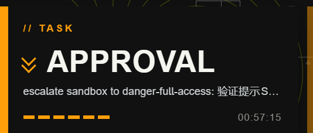
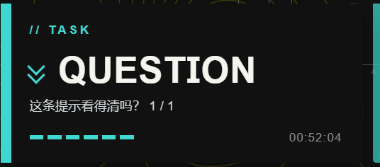

# dsh-task-toast

DeepSeek Harness 插件：**把 agent 的状态显示在右上角**——完成、出错、等你授权、等你回答、还有子 agent 在跑。
视觉沿用 [`dsh-theme-endfield`](https://github.com/ymh0000123/dsh-theme-endfield) 开机加载屏的设计语言
（**只是沿用设计语言，与本插件无隶属关系**；装了那个主题会自动跟随它的配色，没装也照常工作）。

```bash
dsh plugin --profile web add github:jgao9906-droid/dsh-task-toast
```

零依赖、无构建步骤、不用手改 profile 补丁。详见 [安装](#安装)。





> 两张都是真机截图。橙色那张的示例是一次**沙箱提权请求**——所以任务行是宿主生成的
> `escalate sandbox to danger-full-access: …`；那是请求方给的理由，**插件不加工、只单行省略**
> （官方面板里它是多行，这里一行放不下就截断）。工具级授权则显示成 `工具 Bash 请求越权执行`
> ——见下面那段 ASCII 图。

```
┌────────────────────────────────────────────────────┐
│▌ // TASK                                           │  ← 10px 强调色轨（自上而下填充）+ 大字距 kicker
│▌                                                   │
│▌ ❯❯ APPROVAL                                       │  ← 纯边框画的叠层雪佛龙 + 大字（34px）
│▌                                                   │
│▌ 工具 Bash 请求越权执行                               │  ← 一行细节（超出省略）
│▌ ▬▬▬▬▬▬                                   14:32:07 │  ← 6 格方块状态条（依次点亮） + 等宽时钟
└────────────────────────────────────────────────────┘
                                                     ▐  ← 挂起超时后收成这条细边（8px 宽，贴右上角）
                                                     ▐     高度取板子的实测高度，和板子上下边缘齐平
                                                     ▐     鼠标移上去会重新展开，移开又收回
```

**没有版式变化，只有三个变量**：大字换词、强调色换色、那一行换内容。

细边是**可以悬停的**：挂起超时收成细边之后，鼠标移到它上面会把板子重新展开，让你再看一眼"到底在等什么"；移开就再收回。它没有按钮、也不做任何动作，纯"看一眼"。

细边和板子**共用同一条上边缘**（都从距顶 18px 开始），长度也**取板子的实测高度**而不是写死常量——两者必须完全对齐，否则一眼就看得出是错位的两截东西。（最初它贴在视口角落 `top:0`，比板子整整高出一个边距，就是这个毛病。）

## 五个状态

| 状态 | 大字 | 强调色 | 那一行 | 性格 |
| --- | --- | --- | --- | --- |
| 完成 | `COMPLETE` | 跟随主题 `--edge-accent` | 会话标题 | 瞬时：弹 5 秒 |
| 出错 | `ERROR` | 红 `#ff4d4f` | 错误消息 | 瞬时 |
| 会话打不开 | `UNOPENED` | 红（与 ERROR 同色） | 错误码 / 会话标题 | 瞬时 |
| 还有子 agent | `SUBAGENT` | 跟随主题 | 会话标题 | 瞬时 |
| **待授权** | `APPROVAL` | 橙 `#ff9f0a` | `工具 Bash 请求越权执行` 或请求自带的原因 | **挂起** |
| **待回答** | `QUESTION` | 青 `#3fd8d0` | 问题标题（多条时带「共 N 个」） | **挂起** |

### 瞬时 vs 挂起，本质不同

- **瞬时型**：一件事发生了 → 弹 `TOAST_MS` 就走。
- **挂起型**：**agent 正卡着等你**。它不会"5 秒后就没事了"，所以：整块显示 `PENDING_FULL_MS` →
  **收成右上角那条细边**（只表示"有东西在等你"，不带文字、不可交互）→ **直到你处理掉才消失**。
  细边的颜色告诉你等的是哪一类（橙=授权，青=提问）。

挂起型**无视可见性判据，一定发系统通知**——它比"完成了"更该被你知道，而且这时候你多半不在看 DSH。

几条边界行为：

- **同一时刻可能不止一条挂起**（授权可以叠）。来新的 → 整块弹出；答掉一条但还有别的 → 收成细边
  （**不会**继续显示你已经答过的那条）；全部答完 → 细边消失。
- **细边在整块显示期间也留着**，它是板子旁边的"锚点"，同时也是鼠标悬停的目标。这不是顺手为之：
  一个**从鼠标底下被移除**的元素永远不会触发 `mouseleave`，悬停状态会永久卡住、之后再也不响应
  鼠标。有断言盯着这个节点在收起、展开、新挂起到达之间始终是同一个。
- **悬停展开不会抽搐**：命中区只占视口最边上 14px，板子距边缘留 18px，两者**不重叠**——所以鼠标
  停在细边上时板子不会盖住它。这条几何不变式（`EDGE > EDGE_HIT_W`）有断言，而且是**从源码里读
  真值**来比的（早先拿 harness 自己镜像的常量比，结果一个变异体活了下来）。
- **悬停展开的板子在你移开鼠标时收回**；而"新挂起刚到达"的那次播报**不会**被你顺手扫过角落的鼠标
  掐断——两者用不同的标记区分。
- **挂起优先于瞬时**：挂起板子占屏时，完成/出错这类瞬时状态**不抢屏**（DSH 自己的对话流里仍然看得到），
  也不会额外发系统通知（你已经明显在看了）。这是刻意的取舍，不是漏做。

## 三个可见通道，页内板子恒开

各自独立可关（`client.js` 顶部常量）：

| 通道 | 常量 | 覆盖范围 | 前提 |
| --- | --- | --- | --- |
| 页内提示板 | 恒开 | 任何时候 | 无 |
| **系统通知** | `OS_NOTIFY` + `OS_NOTIFY_ONLY_WHEN_AWAY` | **盖在任何程序之上**；DSH 在后台或最小化都行 | 授权一次 |
| 标题栏 ● 前缀 | `TITLE_BADGE` | 任务栏 / 标签页上的廉价兜底 | 无 |

系统通知的标题也按状态分开（`任务完成` / `任务出错` / `等待你授权` / `等待你回答` / `会话打不开`）——
一条写着"任务完成"的通知其实是报错，比不通知更糟。

### 只有系统通知挂可见性判据，板子永远显示

```
任何时候        →  页内提示板（主通道，不受任何判据影响）
没看着 DSH      →  系统通知  +  标题栏 ●
正看着 DSH      →  只有板子（这时再弹系统通知纯属噪音）
```

**所有状态守同一条规则，没有例外。** `PENDING_ALWAYS_NOTIFY = true` 会让挂起型无视判据、
一定发通知——那曾经是默认值（理由是"agent 卡着等你，比完成更该知道"），真机上用了一次就被
否掉了：正盯着屏幕看那块大字板子，同时又弹一条系统通知，纯属重复。想恢复那个行为把它改回
`true` 即可。

`OS_NOTIFY_ONLY_WHEN_AWAY = false` 就退化成"两种都发"。

**板子不挂判据是刻意的**（开发过程中修掉的一个真 bug）：判据一旦在任何环境下不可用，主通道就跟着整个静默——现象是"任务完成了但什么都不弹"。失败模式必须是"多弹一个通知"，而不是"什么都不弹"。

判据是 `document.hidden` / `document.visibilityState`（见 `isLookingAtDsh()`）。**刻意不用 `document.hasFocus()`**：DSH 页面跑在 iframe 里，点一下壳层自己的导航栏就会让 iframe 失焦，那会变成"你正盯着 DSH 却弹系统通知"。

在 Tauri 桌面端上这个判据**不是猜的**：宿主注入的 shim 会在 iframe 里**重定义**这两个属性去镜像**宿主窗口**（宿主失焦/最小化 → `hidden`，回来 → `visible`），并用 `dsh://visibility-state` 校正。

### 板子被节流饿死后会被回收

页面隐藏时定时器会被浏览器/WebView 狠狠节流（后台标签页不保证按时触发 5 秒的 timeout，被挂起的 WebView 可能根本不跑）。板子不再被可见性拦住，所以它可能在页面隐藏时升起，然后**超时了还挂在屏幕上**。

`reapStalePlate()` 因此不看定时器、只看钟：回到前台时若板子已超过自己的截止时刻就直接收掉；**没超时的原样留着，活满自己的全程**（有对照测试，防止它把板子切短）。挂起型的截止时刻是 `PENDING_FULL_MS`（收成细边），不是 `TOAST_MS` —— 两者在默认值下恰好相等，所以有那么一条守卫看起来像死代码；**它有专门的差分测试盯着**（见下方「怎么验证」）。


### 停留时长

`TOAST_MS = 5000`，**对齐 Windows 系统通知的默认档（5 秒）**，让两种情况观感一致。

反方向做不到：**系统通知的时长由 Windows 决定**（设置 › 系统 › 通知 › 显示通知的时长：5/7/15/30 秒），`NotificationOptions` 里根本没有 duration 字段。你把系统那档改成别的，就改 `TOAST_MS` 跟上。

### 授权流程

浏览器要求 `Notification.requestPermission()` 由**用户点击**触发，所以首次回合结束后会出现一块同样风格的一次性询问板（`// NOTIFY` → 开启 / 不用了）。它刻意排在页内提示板消失之后，两者不会重叠。选过之后记在 `localStorage`，**不会再问第二次**；若权限已是 `denied`，则永远不再打扰。

> 在 Tauri 桌面端上这块询问板**不会出现**：宿主的 shim 让 `Notification.permission` 永远返回 `'granted'`，并且把每条 `new Notification(...)` 接到宿主自己的原生通知上。那段询问逻辑只在普通浏览器里有意义。

系统通知的正文带上当前会话标题；`tag` 是 `dsh-notification-<会话id>-0`，**形状是宿主定的契约**——它按这个正则从 tag 里取会话 id，用来让**点击通知直接跳到那个会话**。重复完成用同一个 tag，所以是**替换而不是堆叠**。

### 两条前提（在你的启动方式下都成立）

- `http://127.0.0.1` 属于**安全上下文**（localhost 例外），所以明文 http 下 Notification API 可用；
- 授权按 **origin** 记，而启动脚本把端口写死 `3080`，因此**授权一次长期有效**。若哪天改用随机端口的 DSH Desktop，每次启动 origin 都变，就得重新授权。

### 它够不到的情况

**DSH 窗口被完全关闭时不会通知**——通知跑在页面里，页面没了就没有了。那种情况需要 Host 侧通知（`dsh web` 服务进程仍在，可以走 Windows 原生通知通道），是另一套实现，本插件没做。

另外 Windows「专注助手 / 勿扰」会压掉系统通知，那是系统设置，不是插件能绕过的。

## 安装

```bash
dsh plugin --profile web add github:jgao9906-droid/dsh-task-toast
```

重启或重新加载 `web` profile 后生效。

**不需要额外的构建步骤，也不需要手改 profile 补丁。** 两点值得说明：

- 本包**没有任何 `prepare` / `postinstall` 脚本**，`client.js` 就是可直接运行的源码。
  `dsh plugin` 是 pnpm 的转发器，git 来源的包如果带构建脚本，pnpm 会拦下来要你先在
  `pnpm-workspace.yaml` 里加 `allowBuilds` 白名单——本插件绕开了这一整类麻烦。
- 包声明了 `dsh.bundle.patch`，所以 `dsh plugin add` 会**自动**把它加进 profile 的
  `dsh.profile.bundles` 层栈，不用手动编辑 `cordis.patch.yml`。

开发期改源码时用 `link:` 装更省事（改完刷新页面即生效，不用重装）：

```bash
dsh plugin --profile web add link:<你 clone 下来的路径>
```

卸载：

```bash
dsh plugin --profile web rm dsh-task-toast
```

### 兼容性

- **平台**：纯客户端插件，只用 DOM 与 `document.hidden`，没有平台专有代码。
  在 DSH Desktop（Tauri 壳）上实测运行；普通浏览器里除了系统通知那部分，
  其余行为同样成立。
- **DSH 版本**：针对 `0.1.5-rc.x` 开发与验证。它依赖的内部接口有两类——会话快照的
  字段名，以及**官方面板的两个 data 属性**（`data-approval-key` / `data-question-key`
  / `data-plan-review-key`）。后者属于非官方钩子，DSH 若改名，待授权/待回答会**静默消失**
  （其余状态不受影响），不会报错也不会崩。
- **构建依赖**：运行时零依赖。

### 开发者：怎么验证它是好的

仓库自带三个 harness、一个变异测试矩阵，**零依赖、不需要 DSH 在跑**（`vm` + 假 DOM/假时钟）：

```bash
npm test                 # 三个 harness，共 180+ 条断言
node _mutate.js list     # 列出 20 个变异体，各自对应哪条断言
```

## 它怎么知道每个状态

### 完成 / 子 agent：一个信号位

只认 DSH 自己那份权威状态：

| 步骤 | 调用 |
| --- | --- |
| 取服务 | `ctx.get('sessions')` |
| 当前会话 | `sessions.list.getSnapshot().current` |
| 会话快照 | `sessions.binding(id).session`（`SessionFace = ISession & ObservableSnapshot<SessionSnapshot>`） |
| 状态位 | `session.getSnapshot().running` |

**只对 `true → false` 这一个边沿反应**（一个回合结束），并且：

- 每个会话读到的**第一个值只当基线**，不触发 —— 所以切进一个已经在跑的会话不会误报；
- `sessions.list` 因为标题变化、任务行、侧栏刷新等各种原因频繁推送，同一会话不重新订阅；
- 会话快照暂时不可读（窗口还没开）时会继续订阅，它的第一个真实值成为基线；
- 服务可能晚于 `apply()` 就绪（web boot 并发挂载所有插件行），所以不声明 `inject`，
  一律 `ctx.get` + 120ms 重试。

**"这一回合结束了"不等于"事情干完了"**：如果还有别的会话挂在这个会话底下在跑，大字说 `SUBAGENT`
而不是 `COMPLETE`。两个容易写错的点（我用变异测试钉住了）：

1. 快照上的 `subagent` 字段说的是"**这个会话自己**是个 subagent"（主会话上永远是 `null`），
   **不是**"它有子 agent"。父侧信号只在**列表快照**里。
2. 列表行投影到公开面时父链接叫 **`parentId`**，不是内部的 `parentSessionId`。写成后者会得到一个
   永远为假的判定 —— 编译不报错、日志不报错，状态就是不出现。

### 出错 / 会话打不开：从快照读，但按"变化"报

| 来源 | 说明 |
| --- | --- |
| `api-session/error` 远程事件 | DSH 官方对它的注释是"**没有 turn 位置的实时失败**"的出口 |
| `session.getSnapshot().lastAgentError` | 同一个值，走快照的兜底路径（拿不到 `remote` 时仍然能报） |
| `openState === 'error'` + `openError` | 会话打不开 |

⚠️ **`lastAgentError` 是粘性的**：它只在连接/重置时清空，**不会自己消失**。"非空就报"会永远挂着
一个过期的 ERROR。所以只在**内容变化**时报一次，而且切换会话时把到达那一刻的值当基线
（进到一个早就有旧错误的会话不会突然弹板子）。`openState` 同理，只报**进入** `error` 的那一次跳变。

### 待授权 / 待回答：看官方面板的 DOM

**不订阅远程事件**，尽管那才是"正规"接口。原因是一条实测结论，写在这里免得以后有人
又照着官方插件的写法改回去：

> 官方插件用的是瀑布远程事件 `ctx.remote.$on('approval/request', fn)` /
> `'user-questions/request'`。本插件**也照这个写法实现过**，包括"必须 `return next()` 把决策
> 交回宿主"的契约和对应的变异测试。但在**开发所在的这台机器上（Windows + DSH Desktop，
> `0.1.5-rc.x`）一个远程事件都送不到**：
>
> 实测（把诊断读数打到板子和壳层日志上）得到 `sess=yes remote=yes $on=yes` 而命中数为 **0**
> —— 服务取得到、`$on` 不报错、监听器却从不被调用；连 `api-session/status` 这类 emit 事件
> 也一个不来。查过 cordis 的投递实现（`EventsService` 建在 root、子 ctx 原型继承同一张
> `_hooks`、emit 类派发不过滤），也确认了同类的用户插件 `dsh-tauri-model-config` 用的就是
> `ctx.get('remote')` —— 所以不是"这条路对用户插件不成立"，而是它在这个环境里就是不工作。
>
> **⚠️ 这一条是环境相关的观察，不是放之四海的结论。** 别人的机器上远程事件很可能是正常的
> （官方插件就靠它工作）。如果你在自己的环境里发现 `ctx.remote.$on` 可用，完全可以把它换回来
> —— 但要连同"瀑布事件必须 `return next()`"那条契约一起做，否则会吞掉官方审批面板、
> **让 agent 永久卡在等你授权**。
>
> 本插件选择 DOM 的另一个理由是：不订阅瀑布，就等于**结构上不可能**犯那个错误。
>
> 结论：**用官方面板渲染出来的 DOM 作为唯一真相。**

两个面板都带**语义化 data 属性**（不是哈希过的 CSS 类名），这是它们自己的选择器钩子：

| 面板 | 属性 | 对应状态 |
| --- | --- | --- |
| 审批面板 `dsh-client-ui-approval` | `data-approval-key` | 待授权 |
| 提问面板 `dsh-client-ui-user-questions` | `data-question-key` | 待回答 |
| 计划待审（同一个插件的另一种面板） | `data-plan-review-key` | 待回答 |

推演方式：`MutationObserver` 盯 `document.body`（childList + subtree + characterData），
60ms 防抖后重扫；**面板在 = 有东西在等你，面板消失 = 结束了**。另外在挂载时和"回到前台"时
各扫一次——前者覆盖"刷新时授权面板本来就在屏幕上"，后者覆盖"隐藏期间面板出现、MutationObserver
也被节流"的情况。

那一行的文案 = 面板的 `textContent` 减去它自己的固定文案（`等待审批`/`拒绝`/`允许一次`/
`跳过本题`/`确认执行`…，取自官方 zh 字典），所以留下的是"等的是什么"而不是按钮。`计划待审`
**故意不剥**——它是有意义的状态标签，不是按钮。

三个由此而来的性质：

- **去重靠面板自己的 key**（属性值，如 `approval:1`）。同一个 key 重新渲染**不会**再播一遍
  （否则你在面板里每敲一个字就弹一次）；换 key 才是新请求，才值得重新播报。
- **本插件再也不可能吞掉审批面板**：不监听瀑布，就没有"忘了 `next()` 把 agent 卡死"这个
  失败模式。之前那条警告是真实风险，现在是结构上不可能。
- 代价：这是**非官方钩子**。DSH 若改掉这些 data 属性，状态会静默退化（见下）。

### 拿不到的信号（别指望）

| 想要 | 为什么拿不到 |
| --- | --- |
| `turn/end` 的 `reason`（`completed`/`error`/`aborted`/`blocked`/`max-tokens`/`interrupted`） | 它确实存在于 `SessionEventMap`，但**客户端插件没有订阅点**：`Session.events` 是会话对象自己翻页 transcript 用的内部流，不是公开订阅。把所有 `lib/client.js` 扫过一遍，**没有任何客户端消费者碰 `turn/end`**。所以"这一回合是以什么方式结束的"推不出来 |
| `tool/result` 的 `error: {name, code}` | 同样是 session event，够不到。所以"某个工具报错了"报不出来，只有 **agent 级**错误 |
| 挂起属于哪个会话 | DOM 里只有一个面板，拿不到它挂在哪个会话上（远程事件那条路本来可以用 `ctx.sessions.scopeOf(this)`，但那条路不通）。所以待授权/待回答**不标注会话**，系统通知的点击跳转也指向**当前会话**——子 agent 的授权可能跳错 |
| 主会话"子 agent 全部跑完" | 子会话行消失/停跑时**不会**再产生一次 `COMPLETE`。`SUBAGENT` 之后就没了 —— 要知道全部完成，得再发一条消息或看侧栏 |

**兼容性风险**：待授权/待回答依赖 DSH 官方面板的 **data 属性**（rc 版可能改名）。
最坏情况是这两个状态**静默消失**（只报 `COMPLETE`/`ERROR`），不会崩——每次扫描都套了
try/catch，拿不到节点就当没有。

## 视觉

不是"类似风格"，是照着开机屏的手法逐项复刻：

| 开机屏 | 本插件 |
| --- | --- |
| 左侧 8–10px 强调色进度轨 | 左侧 8px 强调色轨，`scaleY` 自上而下填充 |
| 黄色铺满收尾 | 底部强调色扫光（`scaleX`） |
| `END` / `FIELD` 叠层大字 | 大字：`COMPLETE` / `ERROR` / `APPROVAL` / `QUESTION` / `UNOPENED` / `SUBAGENT` |
| 6 格方块状态条 | 同样的 6 格，带 `animation-delay` 依次点亮 |
| 纯边框叠层雪佛龙 | 同样的 `border-left` + `border-bottom` + `rotate(-45deg)` |
| `letter-spacing: .26em` kicker | 同值 |
| `font-feature-settings: "tnum" 1` | 同值（时钟跳动时宽度不抖） |
| 全直角、发丝描边、`#101110` / `#f5f5f0` | 同值 |

**完成 / 子 agent 的强调色不是硬编码**：走 `var(--edge-accent, #fff500)`。装了终末地主题就自动跟随它的
谷地黄 / 武陵青配色，没装则退回信号黄——两种情况都成立。

**其余状态用状态自己的颜色**（红=错、橙=待授权、青=待回答），因为那是在表达"这不是正常完成"，
不该被主题配色吃掉。它们写在 CSS 的 `[data-state="…"]` 规则里，**hex 与 rgb 三元组成对写死**：
描边与辉光用的是 `rgba(var(--tt-accent-rgb), x)`，而 `var()` 拼不出 rgb 三元组——只改 hex 会让板子
变成"红轨黄光"。`UNOPENED` 的状态规则与 `ERROR` 逐字节相同，且有一条断言盯着它们不许漂移。

## 可调参数

`client.js` 顶部是一组常量（刻意不做设置页，设置命名空间要跨 Host/Client 两半，
且客户端读取时机有一整类竞态；先做成"改一行就生效"）：

```js
const TOAST_MS = 5000                  // 瞬时型停留时长（对齐系统通知的 5 秒档）
const PENDING_FULL_MS = 5000           // 挂起型整块显示多久，然后收成细边
const PENDING_ALWAYS_NOTIFY = false    // 挂起型是否无视可见性也发通知（默认否，见上）
const EDGE_W = 8                        // 可见细边宽度（原 6）
const EDGE_H = 128                      // 细边长度的**退路值**；正常用板子的实测高度
const EDGE_HIT_W = 14                   // 鼠标命中区宽度：比可见的条宽，否则点不中
const EDGE_HIT_PAD = 4                  // 命中区比可见的条上下各多出的量

const WORD_DONE     = 'COMPLETE'
const WORD_ERROR    = 'ERROR'
const WORD_APPROVAL = 'APPROVAL'
const WORD_QUESTION = 'QUESTION'
const WORD_UNOPENED = 'UNOPENED'
const WORD_SUBAGENT = 'SUBAGENT'

const ACCENT_ERROR    = ['#ff4d4f', '255, 77, 79']  // hex 与 rgb 必须成对
const ACCENT_APPROVAL = ['#ff9f0a', '255, 159, 10']
const ACCENT_QUESTION = ['#3fd8d0', '63, 216, 208']

const KICKER = '// TASK'
const TAG_DONE = 'SESSION IDLE'        // 取不到任务名时的回退文案
const OS_NOTIFY = true                 // 系统通知总开关
const OS_NOTIFY_ONLY_WHEN_AWAY = true  // 只在没看着 DSH 时才发系统通知
const TITLE_BADGE = true               // 标题栏 ● 前缀
```

**`PENDING_FULL_MS` 想调长**（比如让挂起板子显示 30 秒再收边）直接改就行，有一条守卫专门保证
它不会被 `TOAST_MS` 提前掐掉——而那正是最容易被忽略的一处。

**细边尺寸**：`EDGE_W` 是可见的条宽度，`EDGE_H` 只是"还没量到板子高度"时的退路——
正常情况下脚本会把板子的实测高度写进 `--tt-edge-h`，细边跟着板子走。`EDGE_HIT_W` 与
`EDGE_HIT_PAD` 决定鼠标真正能碰到的那块。三条必须成立的几何关系，都有断言（且读源码真值）：

1. **命中区比可见的条宽**（否则鼠标点不中）；
2. **板子的 `EDGE` 边距大于命中区宽度**（否则板子会盖住鼠标，悬停立刻结束、变成抽搐）；
3. **可见的条起点 = 板子的上边缘**（命中区多出的 PAD 要在内部减掉，否则整条低 PAD 像素）。

改完重新加载 profile 即可。想额外在回合**开始**时也弹一次，把订阅回调里那句
`if (prev === true && next === false)` 补一个 `else if (prev === false && next === true)`
分支就行（前面的边沿跟踪已经在跑了）。

## 怎么验证

三个 harness，纯 Node，不需要 DSH 运行，也不碰真实 DOM（vm + 假 DOM/假时钟）：

```bash
node verify-toast.js     # 信号与生命周期：基线、边沿、单例、teardown
node verify-notify.js    # 通道：可见性路由、僵板回收、授权询问、系统通知契约
node verify-status.js    # 多状态：五个状态、挂起生命周期、DOM 去重、优先级
```

`verify-status.js` 里几条值得单独说的：

- **不订阅瀑布**：第一条断言就是"任何时刻都没有注册过远程监听器"。这不是洁癖——它就是
  "插件再也不可能吞掉官方审批面板"这个安全性质的表述。
- **差分测试**：把 `PENDING_FULL_MS` 换成 15000 再跑同一套逻辑，验证挂起板子能活过 `TOAST_MS`。
  默认值下两个截止时刻相等，那条守卫看起来像死代码——只有改动一个常量才能证明它不是。
- **面板 key 去重**：同一个 key 重新渲染**不许**再播一遍（否则你在面板里每敲一个字就弹一次），
  换 key 才重新播报。两个方向都有断言。
- **没看着才发通知**：三个状态各有一条"正在看着 → 系统通知数是 0"的断言，加一条
  "没看着 → 通知标题正确"的对照。挂起型曾经豁免于这条规则，被用户实际用过之后否掉了，
  所以现在有变异体专门盯着它不许偷偷豁免。
- **挂载时就有面板**：面板在插件挂载**之前**就存在的场景（刷新时授权框开着）单独测，
  因为那条路径没有 MutationObserver 事件可依赖，只能靠挂载扫描。

### 变异测试（证明上面这些断言真的有牙）

`_mutate.js` 会针对每一条断言造一个**只破坏这一件事**的变异体，harness 必须失败：

```bash
node _mutate.js list              # 列出全部变异体与它对应的断言
node _mutate.js no-dom-observer   # 写出 _mutant.js
node verify-status.js "$PWD/_mutant.js"   # 必须失败
```

| 变异体 | 破坏的是什么 | 结果 |
| --- | --- | --- |
| `no-dom-observer` | 不观察 DOM，挂载后出现的面板全瞎 | 28 条断言失败 |
| `edge-vanishes-on-arrive` | 整块显示时把细边移除（鼠标底下的元素消失了） | 6 条 |
| `no-hover-expand` | 悬停什么都不做（功能整个不存在） | 4 条 |
| `no-copy-strip` | 把面板自己的按钮文案留在那一行 | 4 条 |
| `bar-still-tiny` | 把细边改回那个"看不出来"的长度 | 1 条 |
| `bar-not-aligned` | 细边贴回视口角落（比板子高出一个边距） | 1 条 |
| `bar-hardcoded-height` | 不采用板子的实测高度，用写死的长度 | 1 条 |
| `slip-offset-by-padding` | 忘记在内部减掉命中区的 padding（整条低 4px） | 1 条 |
| `pointer-target-overlaps-plate` | 命中区宽到和板子重叠（悬停会抽搐） | 1 条 |
| `sticky-expires` | 给挂起板子套上普通 toast 的截止时刻 | 2 条 |
| `no-key-dedupe` | 把每次重扫都当新请求（重绘即重播） | 2 条 |
| `transient-wins` | 让瞬时状态顶掉挂起板子 | 2 条 |
| `teardown-orphan` | teardown 不做 DOM 清扫 | 2 条 |
| `pending-exempt-from-visibility` | 让挂起型豁免可见性判据、盯着板子还弹通知 | 2 条 |
| `joins-waterfall` | 偷偷去订阅审批瀑布（唯一能卡死 agent 的写法） | 2 条 |
| `timer-snatches-while-hovered` | 你正指着它，定时器把板子收走 | 1 条 |
| `reduced-motion-stale-selector` | reduced-motion 规则还打在那个动画已经搬走的元素上 | 1 条 |
| `scan-after-teardown` | 卸载后已排队的扫描仍会反应 | 1 条 |
| `internal-parent-field` | 用内部名 `parentSessionId` 代替 `parentId` | 1 条 |
| `error-refires` | 去掉粘性错误的去重 | 1 条 |

判定标准是"**退出码为 0 且打印了成功行**"才算存活——只看有没有 `FAIL` 行会把"harness 直接崩了"
误判成存活（我第一版 runner 就这么错过一次）。

变异测试在这里不是形式：它抓出过四类我自己写的问题——一段**不可达**的防御代码（删掉了）、
一个**打空了的** reduced-motion 规则（动画搬到 `::after` 之后没跟着搬）、**一条拿 harness
自己的常量去比的不变式**（所以 `pointer-target-overlaps-plate` 一开始活了下来），以及
**一个只写一次的高度**（第一次挂起时细边先于板子高度测量被创建，于是永远停在退路值上——
这个 bug 正是被"读板子高度"那条断言逼出来的）。

## 边界

- 提示板与细边都是 `<body>` 子节点 + `pointer-events: none`，不拦截点击与文本选择；`aria-hidden`，
  不打扰读屏。
- 同一时刻只保留一块板子：第二次完成会替换第一块，不会叠起来。细边在挂起期间一直留着（见上）。
- **细边是插件唯一接收鼠标的元素**（命中区 14px 宽，贴在右上角）。代价是它下面那十几像素的应用
  界面点不到——换来"鼠标移上去能再看一眼在等什么"。板子本身仍然是穿透的，不挡任何东西。
- **悬停只是鼠标的便利**，键盘用户够不到它。它不执行任何动作（没有可"激活"的东西），而这一行信息
  DSH 自己的面板里本来就有，所以它是 `aria-hidden` 的——不是因为忘了做无障碍。
- **挂起板子占屏时，瞬时状态被丢弃**（不抢屏、也不再发系统通知）。这是刻意的取舍：挂起意味着
  agent 卡住了，比"完成了"更急；而且此时你明显在看着 DSH，DSH 自己的对话流里就有那条错误。
- 挂起状态依赖官方面板的 data 属性，属于**非官方钩子**；DSH 改名则这两个状态静默消失。
- `prefers-reduced-motion` 下保留出现/消失（那是信息），取消位移与扫光；细边由呼吸改为常亮。
- 提示板与细边 `z-index: 2147482800` —— 低于终末地主题的开机屏（2147483000），高于它的雷霆大字
  （2147482000），所以主题加载动画播放时仍然盖得住。

## 许可证

MIT
